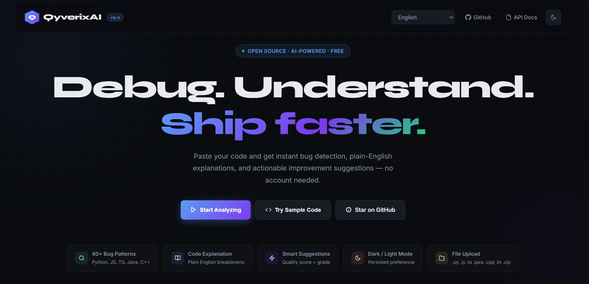

<div align="center">


<br/>
<br/>

<h3>Debug. Understand. Ship faster.</h3>

<p>An open-source AI-powered developer assistant that detects bugs, explains code in plain English,<br/>gives actionable improvement suggestions, and now supports project-wide analysis, AI chat, and live multi-user collaboration.</p>

<br/>

[](https://github.com/imDarshanGK/AI-dev-assistant/actions)
[](LICENSE)
[](https://fastapi.tiangolo.com)
[](https://python.org)
[](CONTRIBUTING.md)
[](https://gssoc.girlscript.tech)
[](Dockerfile)
[](docker-compose.yml)
[](https://docs.pydantic.dev)
[](https://github.com/psf/black)
[](https://github.com/astral-sh/ruff)
[](https://github.com/imDarshanGK/AI-dev-assistant/issues)
[](https://github.com/imDarshanGK/AI-dev-assistant/stargazers)
[](https://github.com/imDarshanGK/AI-dev-assistant/network/members)
[](https://github.com/imDarshanGK/AI-dev-assistant/graphs/contributors)
[](https://github.com/imDarshanGK/AI-dev-assistant/commits/main)

<br/>

**[Live Demo](https://qyverixai.onrender.com)** &nbsp;·&nbsp; **[API Docs](https://qyverixai.onrender.com/docs)** &nbsp;·&nbsp; **[Architecture](docs/ARCHITECTURE.md)** &nbsp;·&nbsp; **[Changelog](docs/CHANGELOG.md)** &nbsp;·&nbsp; **[Contributing Guide](CONTRIBUTING.md)** &nbsp;·&nbsp; **[Good First Issues](https://github.com/imDarshanGK/AI-dev-assistant/labels/good%20first%20issue)**

Read the release history and notable changes in the project changelog: **[docs/CHANGELOG.md](docs/CHANGELOG.md)**.

<br/>

> **GSSoC 2026 Contributors** -- Welcome! Read [CONTRIBUTING.md](CONTRIBUTING.md) for setup, then grab a [good first issue](https://github.com/imDarshanGK/AI-dev-assistant/labels/good%20first%20issue) to get started.

</div>

---

## What is QyverixAI?

QyverixAI is a code analysis workspace. Paste any code - or drop a whole project as a `.zip` - and get this back instantly:

| | What you get |
|---|---|
| **Explain** | Language detection, plain-English summary, complexity estimate, function and class inventory |
| **Debug** | 45+ pattern checks across 5 languages (plus AST-based deep analysis for Python), with exact line numbers, code snippets, and fix suggestions |
| **Improve** | Documentation gaps, error handling, testing, type safety - plus a 0-100 quality score, letter grade A–F, and a before/after diff view |
| **Project Mode** | Upload a `.zip`, get one aggregated score across every file inside it |
| **Ask AI** | Chat about your specific code - answered by an LLM when configured, or a rule-based fallback when not |
| **Collaborate Live** | Open a shared session and edit code, see teammates' cursors, and leave comments together in real time over WebSockets |

No account required for the core analysis. No API key needed. Works fully offline. Fully open source. An optional account unlocks server-side synced history and favorites across devices.

---

## Preview



---

## Features

| Feature | Detail |
|---|---|
| **40+ Bug Patterns** | ZeroDivisionError, bare except, hardcoded secrets, eval/exec, memory leaks, XSS, NullPointerException, unsafe `unwrap()`, and more |
| **5 Languages Detected** | Python, JavaScript, TypeScript, Java, C++ - the first 5 have dedicated bug-pattern checks today |
| **AST-Based Python Analysis** | Real `ast`-module checks beyond regex: unused imports, unused function arguments, dead code after `return`, mutable default arguments |
| **Project / ZIP Analysis** | `POST /analyze/zip/` scans up to 20 source files in an uploaded archive and returns one aggregated project score plus a per-file breakdown |
| **Streaming Analysis (SSE)** | `GET/POST /analyze/stream` streams explanation → debugging → suggestions as they complete, instead of waiting for the full response |
| **Live Collaboration (WebSocket)** | `WS /ws/{session_id}` — multiple users join a session, see each other's presence (name + colour), live code sync, and shared inline comments |
| **AI Chat Assistant** | Ask follow-up questions about your code at `/chat` - uses your configured LLM if enabled, otherwise a built-in rule-based fallback |
| **Full Analysis Endpoint** | One call - explain + debug + improve combined, with timing metrics |
| **Quality Score & Diff View** | 0–100 score with letter grade A–F, prioritised suggestions, and a rendered before/after diff for each fix |
| **Optional Accounts** | Signup/login/logout at `/auth/*` with JWT sessions — logout revokes the token via a server-side denylist so it can't be replayed |
| **Anonymous History** | `/history/` lets unauthenticated users save, search, and delete analysis entries without creating an account |
| **Synced History & Favorites** | Logged-in users get `/user/history` and `/user/favorites`, synced across devices |
| **File Upload Validation** | `/upload/validate` checks extension, blocks executables, and verifies real MIME type (not just the file extension) before accepting a file |
| **Share Links** | Generate a short-lived URL for any analysis and send it to teammates - expires after 7 days |
| **GitHub Action PR Bot** | Drop-in workflow (`.github/workflows/pr-analysis.yml`) that analyzes changed files and comments the results directly on the pull request |
| **Secret Scanning in CI** | Every push/PR is scanned with Gitleaks; see [SECURITY.md](SECURITY.md) for the remediation steps if one is ever caught |
| **Dark / Light Mode** | Persisted across sessions |
| **Download Results** | Export full report as `.txt` |
| **LLM-Ready** | Plug in OpenAI, Groq, Ollama, or any OpenAI-compatible provider via env vars - with retry/backoff and graceful fallback to rule-based mode |
| **Response Caching** | In-memory cache layer for `/analyze/` responses to cut repeat-analysis latency |
| **Rate Limiting** | Configurable per-IP requests/minute |
| **Observability** | `/healthz/live`, `/healthz/ready`, and Prometheus-format `/metrics` - see [Observability](#observability) below |
| **Swagger Docs** | Interactive API docs at `/docs` |
| **Gzip Compression** | Automatic response compression |
| **VS Code Extension** | In-editor analysis via a TypeScript extension (`v0.1.0`) that talks to the same API - see [`vscode-extension/`](vscode-extension/) |

### Languages and patterns

| Language | Patterns detected |
|---|---|
| **Python** | ZeroDivisionError, bare except, eval/exec, mutable defaults, hardcoded secrets, wildcard imports, global variables, string concat in loops, comparison to `None`, assert in production, incomplete assignment, float equality - **plus** AST-based unused imports, unused arguments, and dead code |
| **JavaScript** | `var` usage, loose equality, `console.log` left in, unhandled promises, `innerHTML` XSS, `setTimeout` with a string, async/await without try/catch, unsafe `window.location` assignment, prototype pollution risk, eval usage |
| **TypeScript** | `any` type, unhandled promises, `innerHTML` XSS, `setTimeout` with a string, async/await without try/catch, unsafe `window.location` assignment, prototype pollution risk, `var` usage, `console.log` left in |
| **Java** | Null pointer risk, raw generic types, overly broad `catch (Exception)`, `System.exit()` inside a library, incomplete assignment, float equality |
| **C++** | Memory leaks, unsafe `gets`/`scanf`, `using namespace std`, `void main()`, dangling pointer return, vector unsigned underflow, `malloc` in C++, missing header guard, incomplete assignment, float equality |
| **PHP** | Deprecated `mysql_*` functions, reflected XSS, `extract()` misuse, variable variables (`$$var`), `@`-suppressed errors |
| **Rust** | `unwrap()` overuse, `unsafe` blocks, `panic!()` usage, `expect()` overuse, excessive `.clone()` |
| **Swift / Kotlin** | Auto-detected for explanation and suggestions today; dedicated bug-pattern checks are not written yet - **a good first issue if you want to add them** |

---

## Quick Start

### Prerequisites

- Python 3.11 or 3.12
- pip
- A modern browser (Chrome, Firefox, Edge, Safari)

### 1 - Clone

```bash
git clone https://github.com/imDarshanGK/AI-dev-assistant.git
cd AI-dev-assistant
```

### 2 - Run the backend

```bash
cd backend
pip install -r requirements.txt
uvicorn app.main:app --reload
```
### Environment Setup

Copy `.env.example` to `.env`

```bash
cp .env.example .env
```

Update the environment variable values if needed before running the app.

Important variables:
- `JWT_SECRET`
- `DATABASE_URL`
- `RATE_LIMIT_PER_MINUTE`
- `LLM_API_KEY` (optional)

The app can still run without external AI providers when `LLM_ENABLED=false`. Accounts, history, favorites, and live collaboration all work without `LLM_API_KEY` too - only `/chat` upgrades from rule-based to LLM-backed when a key is set.

| Endpoint | URL |
|---|---|
| API root | http://localhost:8000/ |
| Interactive docs | http://localhost:8000/docs |
| Health check | http://localhost:8000/health |
| Liveness probe | http://localhost:8000/healthz/live |
| Readiness probe | http://localhost:8000/healthz/ready |
| Prometheus metrics | http://localhost:8000/metrics |
| Signup | http://localhost:8000/auth/signup |
| Login | http://localhost:8000/auth/login |
| Current user | http://localhost:8000/auth/me |
| Logout | http://localhost:8000/auth/logout |

The full endpoint list - including project ZIP analysis, AI chat, and live collaboration - is in [API Reference](#api-reference) below.

### 3 - Open the frontend

```bash
# No build step required - open directly in your browser
open frontend/index.html
```

Set the API URL field to `http://localhost:8000`, click **Ping** to confirm the green Connected status, then paste any code and click **Analyze Code**.

> `frontend/index.html` is the single self-contained file actually served — it does not load `frontend/script.js` or `frontend/style.css`. Those two files (plus `security-utils.js`) hold the same logic in separately testable modules and exist primarily so `frontend/tests/` can run focused security/XSS regression tests against them without parsing the full page.

---

## API Reference

All endpoints accept `POST` with `Content-Type: application/json` unless noted otherwise.

**Request body**
```json
{ "code": "your code here", "language": "python" }
```

`language` is optional - the engine auto-detects it from the code.

---

### `POST /explanation/`

Returns a plain-English breakdown of the code.

```json
{
  "language": "Python",
  "summary": "A short Python snippet (5 lines) that performs a focused task.",
  "key_points": [
    "Written in Python — 5 non-blank lines of code.",
    "Defines 1 function: calculate.",
    "Contains conditional logic — branching control flow."
  ],
  "complexity": "Beginner",
  "line_count": 6,
  "function_count": 1,
  "class_count": 0
}
```

---

### `POST /debugging/`

Returns detected issues with line numbers, code snippets, and fix suggestions. For Python, this also includes AST-based findings (unused imports, unused arguments, dead code).

```json
{
  "issues": [
    {
      "type": "ZeroDivisionError",
      "line": 2,
      "description": "Potential division by zero - divisor may be 0 at runtime.",
      "suggestion": "Guard the divisor: if b == 0: return None",
      "severity": "error",
      "code_snippet": "result = a / b"
    }
  ],
  "summary": "Found 1 issue: 1 error, 0 warnings, 0 info.",
  "clean": false,
  "error_count": 1,
  "warning_count": 0,
  "info_count": 0
}
```

---

### `POST /suggestions/`

Returns improvement suggestion cards with a quality score. Each suggestion with an `example` renders as a before/after diff in the frontend.

```json
{
  "suggestions": [
    {
      "category": "Documentation",
      "description": "Less than 10% of lines are comments. Add docstrings.",
      "example": "\"\"\"Calculate the area of a circle given radius r.\"\"\"",
      "priority": "medium"
    }
  ],
  "overall_score": 72,
  "grade": "B",
  "next_step": "Good work. Address the medium-priority items next."
}
```

---

### `POST /analyze/`

All three analyses in one response with timing. Cached - repeat requests with identical code return `X-Cache: HIT` instead of `MISS`.

```json
{
  "provider": "rule-based",
  "model": "qyverix-engine-v3",
  "explanation": { "...": "..." },
  "debugging":   { "...": "..." },
  "suggestions": { "...": "..." },
  "analysis_time_ms": 1.84
}
```

---

### `GET /analyze/stream` and `POST /analyze/stream`

Server-Sent Events stream. Emits `explanation`, `debugging`, and `suggestions` events as each section finishes, followed by a `done` event with timing - useful for showing partial results immediately instead of waiting for the full analysis. The `GET` variant takes `code`/`language` as query parameters.

---

### `POST /analyze/zip/`

Upload a `.zip` (multipart form, field name `file`) and get an aggregated report across every recognized source file inside it. Scans up to 20 files, 5MB of source total, 10MB compressed upload. Unsafe paths, unsupported file types, and oversized archives are reported in `skipped_files` rather than failing the whole request.

```json
{
  "provider": "rule-based",
  "model": "qyverix-engine-v3",
  "file_count": 4,
  "total_size_bytes": 18230,
  "overall_project_score": 81,
  "grade": "B",
  "summary": "Analyzed 4 file(s). Skipped 1 file(s). Overall project score: 81/100.",
  "files": [
    { "filename": "src/main.py", "language": "Python", "size_bytes": 4096, "analysis": { "...": "..." } }
  ],
  "skipped_files": ["node_modules/index.js (unsupported file type)"],
  "analysis_time_ms": 22.4
}
```

---

### `WS /ws/{session_id}`

Real-time collaboration room. Connect with `?name=YourName`; the server assigns a short client ID and a colour, then sends a `session_state` message with the room's current code, language, comments, and connected users.

Client → server message types: `ping`, `code_update`, `cursor_update`, `comment_added`.
Server → client message types: `session_state`, `presence_update`, `pong`, plus broadcasts of the above as other users act. The room is held in memory and is deleted automatically once every participant disconnects - there is no persistence between sessions today.

---

### `POST /chat` and `POST /chat/message`

Ask a follow-up question about a piece of code. `POST /chat` returns a simple `{ "response": "..." }`. `POST /chat/message` additionally accepts a `level` (`beginner`/`intermediate`/`expert`) and returns which engine answered.

```json
// POST /chat/message
{ "message": "Why is line 2 risky?", "code": "result = a / b", "level": "beginner" }
```

```json
{
  "provider": "rule-based",
  "model": "qyverix-engine-v3",
  "mode": "ready+chat_fallback",
  "reply": "Line 2 divides by `b` without checking it isn't zero first..."
}
```

When `LLM_ENABLED=true` and the configured provider responds successfully, `mode` becomes `"live-llm"` instead.

---

### `POST /share/` and `GET /share/{token}`

Create a share link for a saved analysis, then load it back by token for seven days after creation.

`POST /share/` accepts `{ "code": "...", "result": { ... } }` and returns `{ "token": "short_id" }`.

`GET /share/{token}` returns the saved `{ code, result, created_at }` payload or `404` if the share is missing or expired.

---

### `POST /history/`, `GET /history/`, `GET /history/search`, `DELETE /history/{entry_id}`

Anonymous, server-backed history. No login required - useful for the frontend's "Query History" panel without needing an account.

---

### `GET/POST/DELETE /user/history` and `GET/POST/DELETE /user/favorites`

Same idea as `/history/`, but tied to a logged-in user (`Authorization: Bearer <jwt>` from `/auth/login`) so history and favorites sync across devices instead of staying local to one browser.

---

### `POST /auth/signup`, `POST /auth/login`, `GET /auth/me`, `POST /auth/logout`

Standard JWT auth. `logout` records the token's `jti` in a server-side, TTL-bounded denylist (`backend/app/token_denylist.py`) so a logged-out token can't be replayed even though its signature and expiry are still technically valid. The denylist is in-memory and per-process today.

---

### `POST /upload/validate`

Multipart upload (field name `file`). Validates file extension, blocks executable types (`.exe`, `.sh`, `.dll`, …), and checks the *actual* MIME type of the bytes - not just the filename - before the file is accepted for analysis.

```bash
curl -F "file=@app.py" http://localhost:8000/upload/validate
```

---

### `POST /subscribe/` and `POST /subscribe/unsubscribe`

Subscribe an email to the weekly digest, or unsubscribe (also available as `GET /subscribe/unsubscribe?token=...` for one-click email unsubscribe links). Full flow documented in [docs/SUBSCRIPTION_GUIDE.md](docs/SUBSCRIPTION_GUIDE.md).

---

## Project Structure

```
AI-dev-assistant/
├── assets/
│   ├── icon.svg
│   └── logo-dark.svg
├── backend/
│   ├── Dockerfile
│   ├── requirements.txt
│   ├── app/
│   │   ├── main.py                   # FastAPI app, middleware, router registration
│   │   ├── config.py                 # Settings (env-driven)
│   │   ├── database.py               # SQLAlchemy engine/session
│   │   ├── models.py                 # ORM models — User, SharedSnippet, etc.
│   │   ├── schemas.py                # Pydantic v2 request/response models
│   │   ├── schema_validators.py
│   │   ├── security.py               # JWT auth helpers
│   │   ├── sanitize.py               # Input sanitization for code/language fields
│   │   ├── token_denylist.py         # JWT jti revocation store (logout)
│   │   ├── middleware.py             # Rate limiting, request middleware
│   │   ├── observability.py          # Request metrics instrumentation
│   │   ├── routers/
│   │   │   ├── analyze.py            # POST /analyze/, /analyze/stream, /analyze/zip/
│   │   │   ├── debugging.py          # POST /debugging/
│   │   │   ├── explanation.py        # POST /explanation/
│   │   │   ├── suggestions.py        # POST /suggestions/
│   │   │   ├── auth.py               # /auth/signup, /login, /me, /logout
│   │   │   ├── chat.py               # /chat, /chat/message
│   │   │   ├── collaboration.py      # WS /ws/{session_id} — live collaboration
│   │   │   ├── history.py            # Anonymous history endpoints
│   │   │   ├── user_data.py          # Authenticated history + favorites
│   │   │   ├── share.py              # Share-link creation/retrieval
│   │   │   ├── subscribe.py          # Weekly digest subscribe/unsubscribe
│   │   │   ├── upload_file.py        # File upload validation
│   │   │   ├── health.py             # /healthz/live, /healthz/ready
│   │   │   └── metrics.py            # /metrics (Prometheus)
│   │   ├── services/
│   │   │   ├── code_assistant.py     # Rule-based engine — 65+ patterns, 9 languages
│   │   │   ├── ast_analyzer.py       # AST-based deep analysis for Python
│   │   │   ├── ai_provider.py        # Optional LLM abstraction layer
│   │   │   ├── llm_analysis.py       # LLM-backed chat/analysis client
│   │   │   ├── cache.py              # In-memory response cache
│   │   │   ├── database.py           # Async DB helpers for history
│   │   │   ├── email_service.py      # Digest email sending
│   │   │   ├── scheduler.py          # APScheduler jobs (weekly digest)
│   │   │   ├── error_tracking.py
│   │   │   └── line_utils.py
│   │   └── utils/
│   │       ├── file_validator.py     # Extension + real MIME type validation
│   │       └── upload_config.py
│   └── tests/                        # 20+ test files — endpoints, AST, auth, cache,
│                                      # collaboration WS, sanitization, share, zip DoS, etc.
├── frontend/
│   ├── index.html                    # Complete UI actually served — self-contained
│   ├── script.js                     # Modular copy of client logic, not loaded by index.html
│   ├── style.css                     # Modular copy of styles, not loaded by index.html
│   ├── security-utils.js             # Escaping/sanitization helpers, unit-tested directly
│   ├── playwright.config.js
│   └── tests/                        # Node test-runner security tests + Playwright e2e
├── vscode-extension/
│   ├── src/extension.ts              # In-editor analysis extension (v0.1.0)
│   ├── RELEASES.md                   # Versioning/release policy for the project
│   └── CHANGELOG.md
├── docs/
│   ├── ARCHITECTURE.md
│   ├── CHANGELOG.md
│   ├── CORS_INTEGRATION_GUIDE.md
│   ├── SECURITY_MANUAL_TEST_CHECKLIST.md
│   ├── SUBSCRIPTION_GUIDE.md
│   └── admin.md
├── deploy/
│   ├── k8s/deployment.example.yaml
│   └── prometheus/scrape-config.example.yaml
├── tests/                            # Root-level integration tests (separate from backend/tests/)
│   ├── test_api_integration.py
│   └── test_line_references.py
├── screenshots/
│   └── demo.png
├── .github/
│   └── workflows/
│       ├── ci.yml                    # Tests + Ruff lint + Gitleaks secret scan
│       ├── backend-tests.yml
│       ├── frontend-checks.yml       # HTML validation, link checking
│       ├── check-large-files.yml
│       ├── pr-analysis.yml           # Auto-comments on PRs using the rule engine
│       ├── schema-tests.yml
│       └── stale.yml
├── .env.example
├── pyproject.toml                    # Black + isort config
├── Dockerfile
├── docker-compose.yml
├── render.yaml
├── SECURITY.md                       # Secret-leak remediation policy
├── CONTRIBUTING.md
└── README.md
```

---

## Running Tests

```bash
cd backend
pytest -v
```

Backend tests live in `backend/tests/` (endpoints, every supported language, individual bug patterns, AST analysis, authentication + logout/denylist, file upload validation, security sanitization payloads, history/favorites, share links, ZIP-bomb/DoS handling, health/metrics probes, and the collaboration WebSocket) plus a smaller root-level `tests/` folder for integration checks.

```bash
cd frontend
npm install
npm run test:static   # sample/comment regression check
npm run test:e2e      # Playwright end-to-end against a running instance

cd tests
npm test               # Node test runner: XSS/injection regression tests for security-utils.js
```

All of this runs automatically via GitHub Actions - see [CI workflows](#tech-stack) below for which workflow covers what.

---

## Deployment

### Render - recommended, free tier

1. Fork this repository
2. Go to [render.com](https://render.com) → New Web Service
3. Connect your fork - `render.yaml` configures everything automatically
4. Add environment variable: `PYTHON_VERSION` = `3.12.0`
5. Click Deploy - your app goes live at `https://your-service.onrender.com`

> **Note:** The free tier sleeps after 15 minutes of inactivity. The first request after sleep takes 30-60 seconds to wake up. This is expected.

---
## Docker Compose - Full Local Dev Environment

Run the complete stack (backend + frontend + PostgreSQL) with a single command.

### Prerequisites
- [Docker](https://docs.docker.com/get-docker/) and [Docker Compose](https://docs.docker.com/compose/) installed

### 1. Clone the repo
```bash
git clone https://github.com/imDarshanGK/AI-dev-assistant.git
cd AI-dev-assistant
```

### 2. Set up environment variables
```bash
cp .env.example .env
```
Open `.env` and fill in the required values (see [Configuration](#configuration-reference)).
The database is pre-configured in `docker-compose.yml`:
- **User:** `postgres`
- **Password:** `postgres`
- **Database:** `aidevdb`

### 3. Start all services
```bash
docker compose up --build
```

This starts three services:

| Service  | URL                        | Description              |
|----------|----------------------------|--------------------------|
| Frontend | http://localhost:3000      | Nginx-served UI          |
| Backend  | http://localhost:8000      | FastAPI + rule-based engine |
| Database | localhost:5432             | PostgreSQL 16            |

The backend includes a health check - wait for the log line `Application startup complete` before sending requests.

### 4. Verify everything is running
```bash
# Check all containers are up
docker compose ps

# Hit the health endpoint
curl http://localhost:8000/healthz/ready
```

You should see `{"status": "ok"}` (or a `degraded` breakdown if the DB isn't ready yet).

### 5. Open the app
Navigate to **http://localhost:3000**, set the API URL to `http://localhost:8000`, click **Ping** to confirm the green Connected status, then paste any code and click **Analyze Code**.

### Stop containers
```bash
docker compose down
```

To also remove the database volume (wipes all stored data):
```bash
docker compose down -v
```

## Observability

QyverixAI exposes operational endpoints designed for container orchestration and Prometheus scraping.

### Health probes

| Endpoint | Purpose | Behaviour |
|---|---|---|
| `GET /healthz/live` | Liveness probe | Returns `200` while the process can answer HTTP. Does **not** check external dependencies - Kubernetes restarts the container on failure, so this must never depend on recoverable backends. |
| `GET /healthz/ready` | Readiness probe | Returns `200` only when every dependency check (currently: database) passes. Returns `503` with a per-check breakdown otherwise. Kubernetes removes the pod from service load balancers on failure but does **not** restart it. |
| `GET /health` | Legacy combined check | Retained for backward compatibility with anything already pointing at it. |

Example response from `/healthz/ready` when degraded:

```json
{
  "status": "degraded",
  "checks": {
    "database": {
      "ok": false,
      "elapsed_ms": 2003.41,
      "error": "OperationalError: connection refused"
    }
  }
}
```

A ready-to-copy Kubernetes manifest with probes wired up lives at [`deploy/k8s/deployment.example.yaml`](deploy/k8s/deployment.example.yaml).

### Prometheus metrics

`GET /metrics` exposes the Prometheus exposition format. Metric families:

| Metric | Type | Labels | Description |
|---|---|---|---|
| `qyverixai_http_requests_total` | Counter | `method`, `endpoint`, `status_code` | Total requests processed. |
| `qyverixai_http_request_duration_seconds` | Histogram | `method`, `endpoint` | Request latency. Buckets: 5ms → 30s. |
| `qyverixai_http_requests_in_progress` | Gauge | `method`, `endpoint` | Concurrent in-flight requests. |
| `qyverixai_http_request_exceptions_total` | Counter | `method`, `endpoint`, `exception_type` | Unhandled exceptions raised during request handling. |
| `qyverixai_app_info` | Gauge | `version`, `ai_provider` | Static identity, always `1`. |

The `endpoint` label is the matched **route template** (e.g. `/share/{token}`), not the raw URL - this keeps label cardinality bounded as IDs flow through the system. The `/metrics` endpoint itself is excluded from observation to prevent a scrape feedback loop.

A drop-in Prometheus scrape config is provided at [`deploy/prometheus/scrape-config.example.yaml`](deploy/prometheus/scrape-config.example.yaml).

#### Configuration

| Variable | Default | Description |
|---|---|---|
| `METRICS_ENABLED` | `true` | Set to `false` to disable `/metrics` and skip the middleware entirely. |
| `METRICS_AUTH_TOKEN` | - | Optional bearer token. When set, scrapers must send `Authorization: Bearer <token>`. |
| `PROMETHEUS_MULTIPROC_DIR` | - | Set when running `uvicorn --workers N > 1` so scrapes aggregate across workers. The directory must exist and be writable. |

---

## Optional LLM Integration

QyverixAI works fully offline with its built-in rule-based engine. To enable richer AI-powered analysis and a live AI chat at `/chat`, add these environment variables:

```env
LLM_ENABLED=true
LLM_API_KEY=your-key-here
LLM_BASE_URL=https://api.openai.com/v1
LLM_MODEL=gpt-4o-mini
LLM_TIMEOUT_SECONDS=30
```

Compatible with **OpenAI**, **Groq** (free tier), **Together AI**, **Ollama** (local, free), and any OpenAI-compatible endpoint.

> Never commit API keys. Use environment variables or your host's secrets manager. CI also runs Gitleaks secret scanning on every push and PR - see [SECURITY.md](SECURITY.md) for what to do if one ever slips through.

### Provider Reliability
The backend includes built-in resilience for LLM requests:
- **Exponential Backoff**: Automatic retries on timeouts and connection failures.
- **Rate Limit Handling**: Pauses and retries on HTTP 429 Rate Limit responses.
- **Graceful Fallback**: Preserves offline/rule-based features seamlessly if the LLM provider becomes fully unavailable - `/chat` and `/analyze/` keep answering even when the LLM is down.

---

## Configuration Reference

| Variable | Default | Description |
|---|---|---|
| `JWT_SECRET` | - | Signing secret for auth session tokens. Required for `/auth/*` and `/user/*` endpoints. |
| `DATABASE_URL` | SQLite file | Connection string for history, favorites, auth, and share storage. Use a PostgreSQL URL in production. |
| `RATE_LIMIT_PER_MINUTE` | `30` | Max requests per IP per minute |
| `LLM_ENABLED` | `false` | Enable LLM provider for `/analyze/` and `/chat` |
| `LLM_API_KEY` | - | API key for your LLM provider |
| `LLM_BASE_URL` | `https://api.openai.com/v1` | LLM base URL |
| `LLM_MODEL` | `gpt-4o-mini` | Model name |
| `LLM_TIMEOUT_SECONDS` | `30` | Request timeout in seconds |
| `METRICS_ENABLED` | `true` | Enable `/metrics` — see [Observability](#observability) |
| `METRICS_AUTH_TOKEN` | - | Optional bearer token to protect `/metrics` |

Copy `.env.example` to `.env` and fill in values as needed.

---

## Tech Stack

| Layer | Technology |
|---|---|
| Backend | FastAPI 0.115+, Pydantic v2, Python 3.12 |
| Real-time | Native WebSockets (`fastapi.WebSocket`) for live collaboration, Server-Sent Events for streaming analysis |
| Database / ORM | SQLAlchemy 2.0+, SQLite (default) or PostgreSQL, `aiosqlite` for async access |
| Auth | PyJWT for session tokens, in-memory `jti` denylist for logout/revocation |
| Background jobs | APScheduler (weekly digest emails) |
| File validation | `python-magic` for real MIME-type sniffing |
| Metrics | `prometheus-client` |
| Frontend | HTML5, CSS3, Vanilla JS — single self-contained `index.html`, no build step |
| Frontend testing | Node's built-in test runner (XSS/injection regression tests) + Playwright e2e |
| Editor extension | TypeScript (VS Code extension API) |
| Backend testing | Pytest, pytest-asyncio, FastAPI TestClient |
| Linting / formatting | Ruff, Black, isort |
| Security | Gitleaks secret scanning in CI |
| Deployment | Docker, Docker Compose, Render, Kubernetes-ready |
| CI | 7 GitHub Actions workflows: `ci.yml` (tests + lint + secret scan), `backend-tests.yml`, `frontend-checks.yml`, `check-large-files.yml`, `pr-analysis.yml` (PR bot), `schema-tests.yml`, `stale.yml` |

---

## Contributing

QyverixAI is a **GSSoC 2026** open source project. Contributors of all levels are welcome.

```bash
# 1. Fork the repo on GitHub
# 2. Clone your fork
git clone https://github.com/YOUR_USERNAME/AI-dev-assistant.git

# 3. Create a branch
git checkout -b feat/your-feature-name

# 4. Install and test
cd backend && pip install -r requirements.txt
pytest -v   # all tests must pass

# 5. Push and open a pull request
```

Read the full workflow, code standards, and pattern guide in [CONTRIBUTING.md](CONTRIBUTING.md). Architecture overview lives in [docs/ARCHITECTURE.md](docs/ARCHITECTURE.md) (note: it predates several features in this README and could use an update too - also a good first issue).

### Good first issues for GSSoC contributors

| Task | Label |
|---|---|
| Add bug-detection patterns for Swift (currently detection-only) | `easy` |
| Add bug-detection patterns for Kotlin (currently detection-only) | `easy` |
| Update `docs/ARCHITECTURE.md` to reflect collaboration, chat, and ZIP analysis | `easy` |
| Add test cases for edge cases | `easy` |
| Improve explanation key points for a specific language | `easy` |
| Add ARIA labels and keyboard navigation improvements to frontend | `medium` |
| Add inline editor annotations (highlight the buggy line directly in the editor) | `medium` |
| Add a per-function complexity breakdown instead of one whole-file score | `medium` |
| Add a quality-score trend chart from saved history | `medium` |
| Persist collaboration room state so a session survives a server restart | `hard` |
| Add a duplicate / copy-paste code detector | `hard` |
| Publish the VS Code extension to the Marketplace | `hard` |
| Add a `qyverix` CLI / pre-commit hook that runs the rule engine locally in CI | `hard` |

Browse all open issues: [github.com/imDarshanGK/AI-dev-assistant/issues](https://github.com/imDarshanGK/AI-dev-assistant/issues)

---

## Roadmap

- [x] Rule-based code explanation engine
- [x] Bug detection - 45+ patterns across 5 languages, with 2 more auto-detected
- [x] AST-based deep analysis for Python (unused imports/arguments, dead code)
- [x] Improvement suggestions with quality score, letter grade A-F, and diff view
- [x] Full-analysis combined endpoint with timing metrics
- [x] Streaming analysis via Server-Sent Events
- [x] Multi-file / project-wide analysis via ZIP upload
- [x] AI chat assistant with LLM + rule-based fallback
- [x] Real-time multi-user collaboration over WebSockets
- [x] Optional accounts with logout/token revocation and server-synced history and favorites
- [x] Anonymous, no-login history
- [x] Share links with 7-day expiry
- [x] File upload with real MIME-type validation
- [x] In-memory response caching
- [x] Rate limiting per IP - configurable
- [x] Gzip compression middleware
- [x] Dark / light theme, file upload, drag-and-drop, local history, favorites, download
- [x] LLM provider abstraction layer - OpenAI, Groq, Ollama compatible
- [x] Health probes and Prometheus metrics for production deployments
- [x] GitHub Action that comments analysis results on pull requests
- [x] Secret scanning in CI (Gitleaks)
- [x] VS Code extension (functional, v0.1.0 - Marketplace publishing still pending)
- [x] CI matrix - Python 3.11 + 3.12, plus dedicated backend/frontend/schema workflows
- [ ] Bug-detection patterns for Swift and Kotlin
- [ ] Inline editor annotations (highlight buggy lines directly in the code editor)
- [ ] Per-function complexity breakdown
- [ ] Duplicate / copy-paste code detector
- [ ] Quality-score trend chart from history
- [ ] Persistent (not just in-memory) collaboration rooms
- [ ] `qyverix` CLI / pre-commit hook for local + CI use without a server

---

## License

MIT © [Darshan G K](https://github.com/imDarshanGK)

---

<div align="center">

<br/>

**[Star this repo](https://github.com/imDarshanGK/AI-dev-assistant)** &nbsp;·&nbsp;
**[Report a bug](https://github.com/imDarshanGK/AI-dev-assistant/issues/new?template=bug_report.md)** &nbsp;·&nbsp;
**[Request a feature](https://github.com/imDarshanGK/AI-dev-assistant/issues/new?template=feature_request.md)**

<br/>

Built for the open source community &nbsp;·&nbsp; GSSoC 2026

</div>
