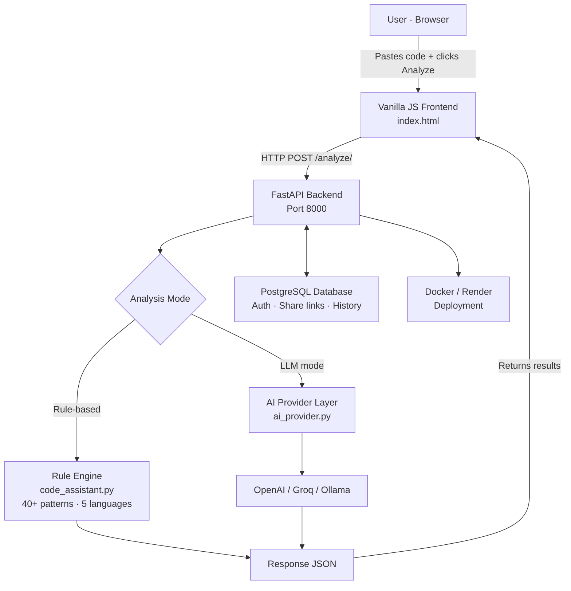

# Architecture — AI Developer Assistant

## Overview

AI Developer Assistant is an open-source tool that helps developers
understand code, detect bugs, and get plain-English explanations.
It uses a rule-based engine for fast analysis and optionally connects
to an LLM (like OpenAI or Groq) for deeper insights.

---

## System Architecture

---

## Request Flow

1. User pastes code into the editor in the browser
2. Frontend sends a `POST` request to `/analyze/` on the FastAPI backend
3. Backend decides: use rule-based engine or LLM based on config
4. Result is returned as JSON and rendered in the UI

---

## Layers Explained

### 1. Frontend
- **File:** `frontend/index.html`
- Plain HTML + Vanilla JavaScript (no framework)
- Sends code to backend via `fetch()` API
- Renders results: Plain-English breakdown, suggestions, code fixes

### 2. FastAPI Backend
- **File:** `main.py`
- Runs on port `8000`
- Handles routing, auth middleware, and API responses
- Connects frontend to the analysis engine and database

### 3. Rule-Based Engine
- **File:** `code_assistant.py`
- 40+ pattern rules across 5 languages (Python, JS, TS, Java, C++)
- Fast, offline, no API key needed
- Detects common bugs, anti-patterns, and style issues

### 4. LLM Abstraction Layer
- **File:** `ai_provider.py`
- Optional — only used when an API key is configured
- Supports OpenAI, Groq, and Ollama
- Provides deeper analysis and natural language explanations

### 5. Database
- **Technology:** PostgreSQL
- Stores user auth, share links, and analysis history
- Used only when auth/sharing features are enabled

### 6. Deployment
- Supports **Docker** (via `Dockerfile`)
- Also deployable on **Render** (cloud hosting)

---

## Key Files for New Contributors

| File | Purpose |
|------|---------|
| `main.py` | FastAPI app entry point |
| `code_assistant.py` | Rule-based analysis engine |
| `ai_provider.py` | LLM provider abstraction |
| `frontend/index.html` | Entire frontend UI |
| `requirements.txt` | Python dependencies |
| `Dockerfile` | Container setup |
| `README.md` | Setup and usage guide |

---

## Rule-Based vs LLM Mode

| | Rule-Based | LLM Mode |
|---|---|---|
| Speed | Fast | Slower |
| Requires API key | No | Yes |
| Works offline | Yes | No |
| Analysis depth | Pattern matching | Deep reasoning |
| Languages supported | 5 | Any |

---

## Contributing

New to the project? Start here:
1. Read `README.md` for setup instructions
2. Look at `code_assistant.py` to understand how rules work
3. Check open issues labeled `good first issue`
4. See `CONTRIBUTING.md` for PR guidelines
